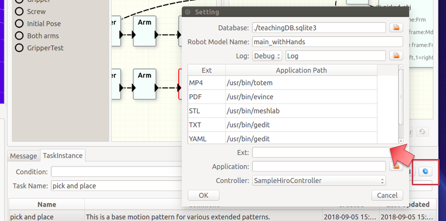

# teachingPluginの設定

##<i class="fa fa-arrow-circle-right" aria-hidden="true"></i> コントローラの切替え

teachingPlugin上でのfake実行（動きの確認）とROSのFollowTrajectoryやMoveIt!を用いた外部シミュレータないし実機への出力の切替えはControllerを切替えることにより行います。ここで表示されるコントローラは、ロードされている[コントローラプラグイン](/controller.md)で登録されたものです。その中から1つを選択して使用します。

!!!Note
    現在、複数のコントローラを同時に使用する機能はありません。また、コントローラの切替え時には再起動が必要です。

##<i class="fa fa-arrow-circle-right" aria-hidden="true"></i> その他の設定

このダイアログでは、使用するデータベースファイル（teachingDB.sqlite3等）の指定や、各タスクデータに対応づけられたファイルを開くときに使用するアプリケーションの設定も行います。
