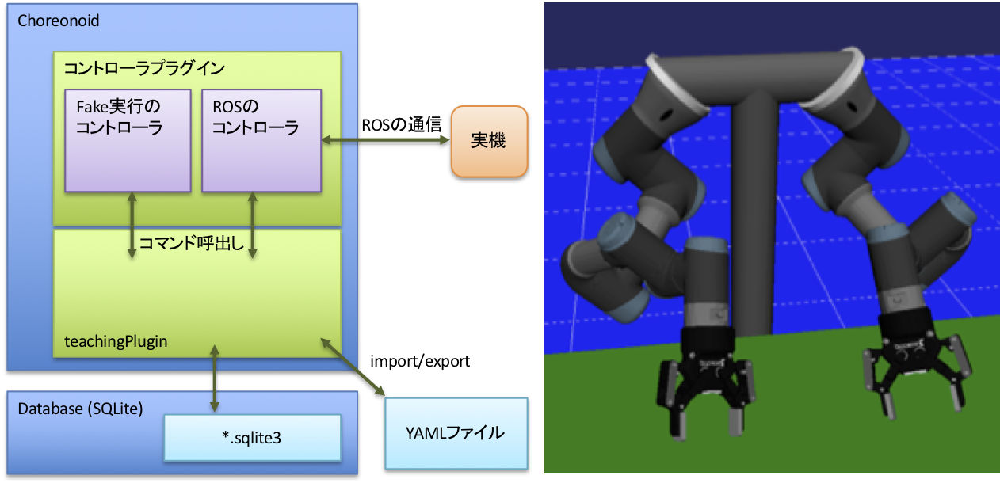

# コントローラ



コントローラはteachingPlugin本体とは別にChoreonoidのプラグインとして実装します。


##<i class="fa fa-arrow-circle-right" aria-hidden="true"></i> コントローラの実装方法

UR3を双腕構成にしたロボットを例として、その実装方法を説明します。
ソースコードの全体は[`UR3dualController.h`](https://bitbucket.org/hanai/samplehirocontroller2plugin/src/master/UR3dualController.h)と[`UR3dualController.cpp`](https://bitbucket.org/hanai/samplehirocontroller2plugin/src/master/UR3dualController.cpp)を参照してください。

まず、コントローラは`ControllerFramework.h`をインクルードし、`teaching::Controller`クラスの子クラスとして実装します。
次にteachingPluginから呼出すためにstaticメソッドinstance()を用意します。
コマンドは内部クラスとして実装します。以下では腕を動かすコマンド`MoveArmCommand`のクラスを定義しています。

```c++
// UR3dualController.h

#include "ControllerFramework.h"

namespace teaching
{

  class UR3dualController : public Controller
  {
  public:
    static UR3dualController* instance();

  private:
    class MoveArmCommand : public Command
    {
    public:
      MoveArmCommand(UR3dualController* c) { c_ = c; }
      UR3dualController* c_;
      virtual bool operator()(std::vector<CompositeParamType>& params);
    };
	
	...


```

次にコマンドの実装を書きます。ここではteachingPlugin上でfake実行するコードを書きます。
コンストラクタから`registerCommands()`メソッドを呼出し、`registerCommands()`の中で`registerCommand()`を呼出しています。`registerCommand`はteachingPluginにこのコマンドを登録するとともに、その呼出し方（インタフェース）を知らせるものです。第一引数がコマンドの内部名、第二引数が表示名（GUI上で表示される名前でユーザが付け替えることが可能）です。第三引数に 返り値の型、第四引数のにコマンドに対する引数の名前と型を指定します。最後の引数がコマンドの実装インスタンスです。teachingPluginはこのルールにしたがって呼出しを行います。


```c++
// UR3dualController.cpp

namespace teaching
{

  UR3dualController* UR3dualController::instance()
  {
    static UR3dualController* controller = new UR3dualController();
    return controller;
  }

  UR3dualController::UR3dualController()
  {
    registerCommands();
  }

  ...

  void UR3dualController::registerCommands()
  {
    registerCommand("moveArm", "Arm", "boolean",
                    {A("xyz", "double", 3), A("rpy", "double", 3), A("tm", "double", 1), A("armID", "int", 1)},
                    new MoveArmCommand(this)); // 0=left, 1=right

    ...
  }
  
```

次に`moveArm`コマンドが呼出されたときの処理を書きます。最初にVariantとして渡された引数を目的の型として取出します。この部分はどのコマンドでも同様になります。後はコマンドごとの処理になります。ここでは関節角度を補間して再生しています。

```c++

  bool UR3dualController::MoveArmCommand::operator()(std::vector<CompositeParamType>& params)
  {
    Vector3 xyz(boost::get<VectorX>(params[0]));
    Vector3 rpy_tmp(boost::get<VectorX>(params[1]));
    Vector3 rpy = toRad(rpy_tmp);
    double duration = boost::get<double>(params[2]);
    int armID = boost::get<int>(params[3]);
    printLog("moveArm(", xyz.transpose(), ", ", rpy.transpose(), ", ", duration, ", ", armID, ")");

    BodyPtr body = c_->getRobotBody();
    Link* base = body->rootLink();
    Link* wrist = body->link(c_->getToolLinkName(armID));

    JointPathPtr jointPath = getCustomJointPath(body, base, wrist);
    jointPath->calcForwardKinematics();

    c_->ci.clear();
    c_->ci.appendSample(0, wrist->p(), wrist->attitude());
    c_->ci.appendSample(duration, xyz, rotFromRpy(rpy));
    c_->ci.update();
    return c_->executeCartesianMotion(wrist, jointPath);
  }
```

最後にChoreonoidのプラグインとするためのおまじないを行います。`initiaize`メソッドはプラグインのロード時に実行され、その中の`ControllerManager::instance()->registController(...)`でteachingPluginにコントローラを登録しています。

```c++
// SampleHiroControllerPlugin.cpp

using namespace cnoid;
using namespace teaching;

class SampleHiroControllerPlugin : public Plugin
{
public:

  SampleHiroControllerPlugin() : Plugin("SampleHiroController")
  {
    require("Body");
    require("Teaching");
  }

  virtual bool initialize()
  {
    ControllerManager::instance()->registController("UR3dualController", UR3dualController::instance());

    ...


CNOID_IMPLEMENT_PLUGIN_ENTRY(SampleHiroControllerPlugin);
```


!!!Note
    サンプルコードでは複数のコントローラを1つのプラグイン内で実装していますが、別のプラグインとした方が筋が良いです。

!!!Note
    現在の実装では、teachingPluginは複数のコントローラが登録されていたとしても、設定ファイルで指定された1つのコントローラのみ使用します。

タスクは明示的に特定のロボットやコントローラへの依存性を記述しません。上記の説明からわかる通り、teachingPluginはフロー、タスク、コマンドの実行時に対象コマンドが選択されているコントローラで実装されているかどうかを実行前にチェックし、全て実装されていれば実行を行います。異なるコントローラで同じI/Fのコマンドが実装されていればそのタスクは実行可能です。ただし、期待した動作になるかどうかは実装に依存します。

<!-- 登録されているI/Fが間違っている場合はエラーに、I/Fも正しくて実装 -->
<!-- がおかしい場合は意図と異なる動作を行うことになります。-->


##<i class="fa fa-arrow-circle-right" aria-hidden="true"></i> ROSを使ったコントローラの実装

UR3の双腕構成ロボットを例にROSを使った実装について説明します。ここでは`control_msgs::FollowJointTrajectoryAction`を利用してROS対応の実機や外部シミュレータと通信を行います。UR3およびRobotiqグリッパのROSによるdriverは複数あるので、ここでは以下の2つを使用しています。

* `git clone -b iron-kinetic-devel https://github.com/iron-ox/ur_modern_driver`
* `git clone https://github.com/beta-robots/robotiq`

`FollowTrajectoryControllerUR3Dual.h`でコマンド`MoveArmCommand`のクラスを定義する箇所はfake実行の場合とほぼ同じです。`FollowTrajectoryControllerUR3Dual.cpp`で`registerCommand`を行う箇所、`MoveArmCommand`の実装で引数のVariantを解釈する箇所は同じです。

主な違いは`MoveArmCommand::operator()`の実装の中で、生成した軌道をROSのメッセージに詰めて送信した後、アームとグリッパの関節角度を受信しながら「シーン」ビューを更新する部分くらいになります。

```c++
    trajectory_msgs::JointTrajectory traj;
    traj.header.stamp = ros::Time::now();
    int nJoints = 1;
    traj.joint_names.push_back(gripperDriverJoint);

    for (double time = 0.0; time < duration+dt; time += dt) {
      if (time > duration) { time = duration; }
      VectorXd qRef;
      qRef = c_->jointInterpolator.interpolate(time);

      trajectory_msgs::JointTrajectoryPoint p;
      p.positions.resize(nJoints);
      p.velocities.resize(nJoints);
      for (int i = 0; i < nJoints; i++) {
        p.positions[i] = qRef[i];
        p.velocities[i] = 0.0;
      }
      p.time_from_start = ros::Duration(time);
      traj.points.push_back(p);
    }

    control_msgs::FollowJointTrajectoryGoal goal;
    goal.trajectory = traj;
    traj_client->sendGoal(goal);
    while (!traj_client->getState().isDone()) {
      c_->syncWithReal();
    }
```

!!!Note
    ROS(Kinetic)で動作確認しています。


<!-- ##<i class="fa fa-arrow-circle-right" aria-hidden="true"></i> MoveIt!を使ったコントローラの実装 -->

<!-- `MoveArmCommand`等を実装するにあたり、MoveIt!経由でロボットに軌道を送ることが考えられます。そうすることで、MoveIt!の自己干渉や環境との干渉を検出（あるいは回避）する機能、軌道実行時間の自動計算等を利用することが考えられます。 -->

<!-- (tbd) -->
