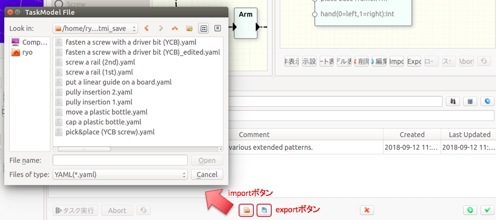

# Import/Export

本ソフトウェアではタスクやワークフローのデータはデータベースファイルで一括して管理されます。データベースに保存されているタスクデータは必要に応じて[YAMLファイル](/task_design/#yaml_format)にexportすることができます。

逆に、YAMLファイルをデータベースにimportすることもできます。エディタや別のツールで作成したデータを使用する場合には、このimport機能を使用します。

タスクをexportすると、同じディレクトリにそれらによって参照されている3Dモデルや画像等のファイルも出力されます。逆にデータをimportするときにはYAMLファイルと同じディレクトリに参照されているファイルを置いておく必要があります。

YAMLファイルに3Dモデルのマスタ情報が記述されている場合、import時にそのデータがマスタ管理テーブルに登録されます。ただし、同じYAMLファイルを複数回importした場合にマスタが重複して登録されることを回避するため、import時にマスタ管理テーブルに同じデータが登録済みの場合にはimportしたタスクはそのデータを参照し、新規のエントリ追加は行いません。このときのマスタの同一性チェックはVRMLファイルに対して計算されるハッシュ値を用いて行なわれます。

!!!Warning
    * 同様にフローのimport/export機能もありますが、こちらはexperimentalです。
    * 同一のVRMLデータに異なるfeature定義を行い別のマスタとして登録することはできません。
