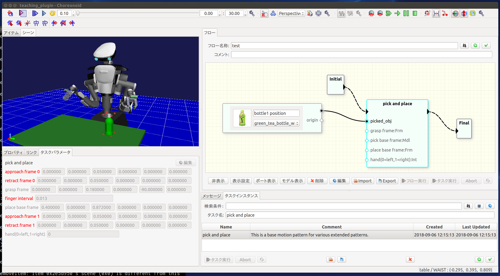

# Welcome to teachingPlugin (2019.07.22)
---
<!-- For full documentation visit [mkdocs.org](https://mkdocs.org). -->

##<i class="fa fa-arrow-circle-right" aria-hidden="true"></i> はじめに

teachingPluginはロボットの教示ソフトウェアの一種です。あらかじめ設計されたロボットの動作パターンを組合わせることで、より長い作業手順を記述します。3Dモデルを動作パターンに紐付けることで、3Dモデルの位置や3Dモデル上に定義した座標系を利用して動作パターンを調整することができます。また、3Dモデルに加えて画像やテキスト等のデータも合わせて利用することで、ユーザが動作パターンの目的を理解し、再利用しやすい形でのデータ管理を可能とします。

本ソフトウェアは、産総研で開発されたロボット用統合GUIソフトウェアである[Choreonoid](http://choreonoid.org/ja/)のプラグインとして動作します。




<!-- !!!Note -->
<!--     現在アクティブに開発中であるため一部の仕様に変更がある可能性があります。ある程度基本機能が使えるようになったタイミングでタグをうちます。 -->

##<i class="fa fa-arrow-circle-right" aria-hidden="true"></i> インストールと実行

### 動作環境

* Ubuntu18.04LTS
* Choreonoid 1.7.0

### 環境構築、サンプルデータの入手と実行

```console
# Choreonoidのダウンロードと依存パッケージのインストール
$ wget https://choreonoid.org/_downloads/choreonoid-1.7.0.zip
$ unzip choreonoid-1.7.0.zip
$ cd choreonoid-1.7.0/
$ ./misc/script/install-requisites-ubuntu-18.04.sh
$ mkdir -p build

# teachingPluginとサンプルコントローラのダウンロード
$ git clone https://github.com/ryhanai/teachingplugin ext/teachingPlugin
$ git clone https://github.com/ryhanai/SampleTPControllerPlugin ext/SampleTPControllerPlugin
$ ./ext/teachingPlugin/misc/install-requisites-ubuntu-18.04.sh

# コンパイル
$ cd build
$ cmake .. -DBUILD_TEACHING_PLUGIN=ON -DBUILD_SAMPLE_HIROCONTROLLER=ON
#
# GUIを使いたい場合は
# $ ccmake .. # BUILD_TEACHING_PLUGIN=ON, BUILD_SAMPLE_HIROCONTROLLER=ONにする（デフォルトでON）
# 必要ないオプションを切ると、コンパイル時間を短くできます。

$ make -j8

# サンプルデータの取得
$ cd ../choreonoid-1.7.0/ext/teachingPlugin/share/project
$ wget "https://drive.google.com/uc?export=download&id=119r3ddfe8cumd2JSz4dFfbiD3YWBMfKd" -O teachingDB.sqlite3

### 実行
$ choreonoid-1.7.0/build/bin/choreonoid teaching_plugin.cnoid
```

!!!Note
    サンプルデータのダウンロードに失敗する場合は、[ここ](https://drive.google.com/open?id=119r3ddfe8cumd2JSz4dFfbiD3YWBMfKd)から手動でダウンロードし、`teachingDB.sqlite3`という名前で保存してください。


##<i class="fa fa-arrow-circle-right" aria-hidden="true"></i> ライセンス

本ソフトウェアはオープンソースソフトウェアとして開発されており、そのライセンスはMITライセンスとしております。


<!-- ##<i class="fa fa-arrow-circle-right" aria-hidden="true"></i> Dockerイメージの利用 -->

<!-- Dockerイメージを使って試す場合は以下の手順を行います。Ubuntu Linux 16.04LTSを想定しています。 -->

<!-- ### Dockerのインストール -->

<!-- Dockerのインストール方法はDockerのホームページに記載されています。 -->

<!-- [https://docs.docker.com/engine/installation/](https://docs.docker.com/engine/installation/) -->

<!-- 下記のコマンドを順番にシェル上で実行します。 -->

<!-- ```console -->
<!-- $ sudo apt-get remove docker docker-engine docker.io -->
<!-- $ sudo apt-get update -->
<!-- $ sudo apt-get install apt-transport-https ca-certificates curl software-properties-common -->
<!-- $ curl -fsSL https://download.docker.com/linux/ubuntu/gpg | sudo apt-key add - -->
<!-- $ sudo apt-key fingerprint 0EBFCD88 -->
<!-- $ sudo add-apt-repository "deb [arch=amd64] https://download.docker.com/linux/ubuntu $(lsb_release -cs) stable" -->
<!-- $ sudo apt-get update -->
<!-- $ sudo apt-get install docker-ce -->
<!-- ``` -->

<!-- ### 実行 -->

<!-- ```console -->
<!-- $ docker run --rm --net host -e DISPLAY=$DISPLAY -v $HOME/.Xauthority:/root/.Xauthority -it hanai/teaching-plugin -->
<!-- $ cd choreonoid/ext/teachingPlugin/share/project -->
<!-- $ ~/choreonoid/build/bin/choreonoid teaching_plugin.cnoid -->
<!-- ``` -->

<!-- !!!Note -->
<!--     dockerホスト側で`xhost local:`などとしてXの接続を許可する必要があります。 -->
	
	
<!-- ### nvidia-dockerの利用 -->

<!-- Nvidiaのカードをご利用の場合はnvidia-dockerを使用して動作させることができます。 -->

<!-- #### nvidia-docker (version 1)のインストール -->

<!-- [nvidia-dockerのホームページ](https://github.com/NVIDIA/nvidia-docker/wiki/Installation-(version-1.0))を参考にインストールします。 -->

<!-- #### docker buildの実行 -->

<!-- 以下をDockerfileに記述します。 -->

<!-- ```console -->
<!-- FROM hanai/teaching-plugin -->

<!-- LABEL com.nvidia.volumes.needed="nvidia_driver" -->
<!-- ENV PATH /usr/local/nvidia/bin:${PATH} -->
<!-- ENV LD_LIBRARY_PATH /usr/local/nvidia/lib:/usr/local/nvidia/lib64:{LD_LIBRARY_PATH} -->
<!-- ``` -->

<!-- #### dockerイメージの作成 -->

<!-- Dockerfileのあるディレクトリで以下を実行します。 -->

<!-- ```console -->
<!-- $ docker build -t teaching-plugin-nvidia . -->
<!-- ``` -->

<!-- #### dockerコンテナの起動 -->

<!-- ```console -->
<!-- $ nvidia-docker run --rm --net host -e DISPLAY=$DISPLAY -v $HOME/.Xauthority:/root/.Xauthority -it teaching-plugin-nvidia -->
<!-- ``` -->
