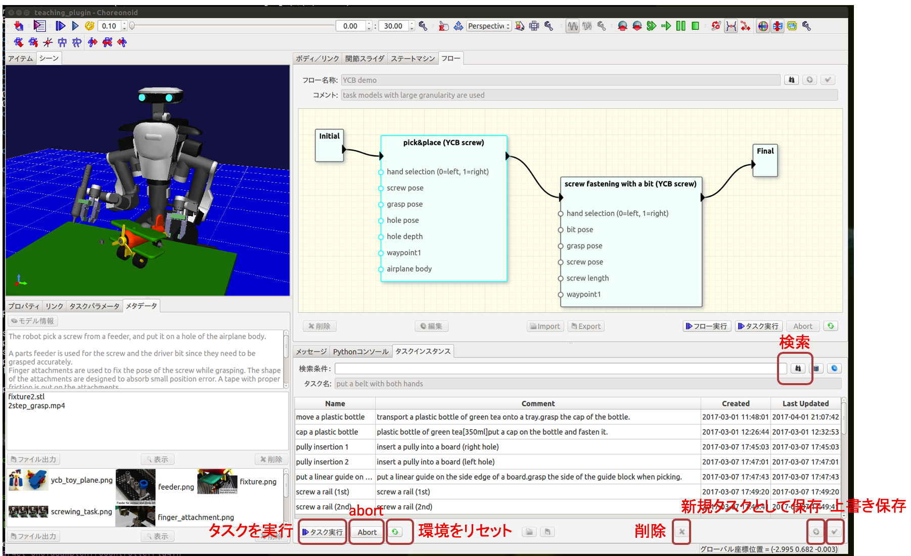

# タスク

##<i class="fa fa-arrow-circle-right" aria-hidden="true"></i> タスクデータとは

本ソフトウェアでは、ロボットの動作パターンと「ユーザがその動作で意図した作業内容を理解したり、動作パターンを調整するために役立つデータ」をまとめて管理します。後者のデータには3Dモデルと自由形式（画像やテキスト、動画など）のものがあります。

本ソフトウェアではこのデータ単位をタスクと呼びます。狭義には自由形式のデータはタスクに含めませんが、以降の説明では明確に区別はしません。

##<i class="fa fa-arrow-circle-right" aria-hidden="true"></i> 検索と実行

1. 「タスクインスタンス」ビューのテキストボックスに適当なキーワードを入力し、「検索」ボタンを押します。キーワードを空白区切りで複数指定するとand検索になります。空文字列で検索を行うと全データが表示されます。
2. 検索結果の一覧から適当なものをクリックして選択した後、「タスク実行」ボタンを押します。「シーン」ビューを見てロボットの動作を確認します。

検索結果一覧には、タスクデータにつけられた名前、コメント、データの生成日時と最終更新日時が表示されます。一覧からあるエントリを選択すると、そのデータに登録されている3Dモデルが「シーン」ビュー内に表示されます。また、自由形式のファイルが対応づけられている場合には「メタデータ」ビューに表示されます。「メタデータ」ビューデータをダブルクリックすると画像は拡大表示、その他のデータは登録された外部アプリケーションで表示することができます。「メタデータ」ビューの該当するエリアにファイルをドラッグ&ドロップすることでファイルを追加することができます。ファイルの削除には「削除」ボタンあるいはdeleteキーを使用します。ファイルの並び順を変更するにはエリア内でドラッグします。

### 環境のリセット

タスクデータには3Dモデルに対する操作が記述されている場合があります。典型的にはロボットが物体を把持するタイミングでグリッパのリンクと把持対象物品の相対的な位置関係が固定（attach）され、物品を置いたタイミングでグリッパのリンクと把持されていた物品の間の位置関係の固定が解除（detach）されます。具体的にどのタイミングでどの操作が行われるかはタスクデータの定義に依存します。

このような操作の結果、タスクを一度実行すると3Dモデルの位置が変化します。「モデル位置を元に戻す」ボタンを押すことで、3Dモデルの配置を初期位置に戻すことができます。

ロボットの姿勢を初期化したい場合にはChoreonoidの機能をそのまま使用します。「アイテム」ビューからロボットのアイテム（サンプルデータの場合は`main_withHands`）を選択した状態で、ツールバーの「選択ボディを標準姿勢に」ボタンを押します。

### 実行中断、コマンド単体での実行

実行中の動作を中断する場合には「abort」ボタンを押します。このボタンを押すと、その時に実行しているコマンドが終了した段階でタスクの実行を終了します。

あるタスクの動作パターンはそのタスクを選択した状態で、「ステートマシン」ビューで確認することができます。ここで「コマンド実行」ボタンを押すことにより、単一のコマンドを実行することができます。動作シーケンスにおける特定の状態（物品把持位置など）を確認するときに役立ちます。ただし、動作シーケンスを実行した場合の環境に対する操作が再現される場合ではない点に注意が必要です。

##<i class="fa fa-arrow-circle-right" aria-hidden="true"></i> 動作の調整

### パラメータ値の変更方法

動作パターンは通常、ある程度の調整が可能な形で定義されます。どのようなパラメータでどのような動作の調整を可能とするかは、アプリケーションやタスク設計者の経験、利用者が期待する使い方に大きく依存するので、ユーザ定義となっています。典型的には以下のようなパラメータが考えられます。

* 対象物配置を調整可能とするパラメータ（pickする対象物の位置や把持している物品を組付ける位置）
* グリッパの違いを調整可能する把持姿勢に関するパラメータ
* ネジ締めトルクや押さえつける力等の制御パラメータ
* 類似部品を表現するパラメータ

パラメータを数値入力により変更するには「タスクパラメータ」ビューを使用します。

### 3Dモデルの位置変更

物体の位置や姿勢の表現をフレームと呼びます。フレームは3Dモデルに紐付けることができます。タスクの定義時にタスクパラメータと3Dモデルの対応づけは行われますが、タスク利用時に別の3Dモデルに差替えることが可能です。この3Dモデルの差替えの詳細は[ワークフロー](/workflow.md)で説明します。タスクパラメータが3Dモデルに対応づけられているとき、その3Dモデルを「シーン」ビュー中で移動させることにより、タスクパラメータ値を変更することができます。

##<i class="fa fa-arrow-circle-right" aria-hidden="true"></i> データの保存、複製、削除

状態遷移図やパラメータ、メタデータなどの変更をデータベースに保存するには「選択したタスクを上書き保存する」ボタンを押します。既にあるタスクを残したまま別のタスクとして保存したい場合は、「新規タスクとして保存する」ボタンを押します。

タスクを削除するには、対象の選択した状態で「選択したタスクを削除」ボタンを押します。

<!-- ## デバッグ実行 -->
