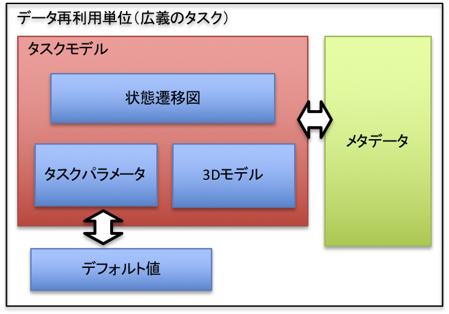

# タスクの設計 

ここでは、再利用単位となるデータの設計について説明します。

##<i class="fa fa-arrow-circle-right" aria-hidden="true"></i> タスクの構造

<!--  -->


##<i class="fa fa-arrow-circle-right" aria-hidden="true"></i> <a id="yaml_format">YAMLフォーマット</a>

具体的な記述例については、サンプルデータに付属するファイルを参照してください。

* YAML形式のタスク記述仕様
以下で、{}はYAMLのMappingを、*はCollectionをそれぞれ表す。
文字列の後にコロン（:）が付いたものはキーワードを表す。
MappingやCollectionの具体的な表記はYAMLの仕様にしたがう。

```C++
<task_desc>  ::= {taskName: <string>,
                  comment: <string>,
                  models: <model-def>*,
                  states: <state-def>*,
                  transisions: <transition-def>*,
                  parameters: <parameter-def>*,
                  files: <file-def>*,
                  images: <image-def>*,
                  model-master: <master-def>*}

<model-def>  ::= {name: <string>,
				  master_name: <string>,
				  type: <model-type>,
				  pos: <frame>}

<state-def>  ::= <init-state-def> | <fin-state-def> 
               | <command-state-def>
               | <decision-state-def> | <merge-state-def>}

<init-state-def> ::= {id: <int>,
                      type: 1,
                      pos: <2d-vec>}

<fin-state>   ::= {id: <int>,
                     type: 2,
                     pos: <2d-vec>}

<command-state> ::= {id: <int>,
                     type: 5,
					 cmd_name: <string>,
					 disp_name: <string>,
					 arguments: <argument>*
                     model_actions: <model-action>*,
                     pos: <2d-vec>} 

<decision-state> ::= {id: <int>,
                      type: 3,
					  condition: <expr>,
                      pos: <2d-vec>}

<merge-state>   ::= {id: <int>,
                     type: 6,
                     pos: <2d-vec>}

<argument>      ::= {name: <string>,
					 value: <expr>}

<model-action>  ::= {action: <action-type>,
                     model: <string>,
					 target: <expr>}

<action-type>   ::= "attach" | "detach"

<transition>    ::= {source_id: <int>,
                     target_id: <int>,
					 source_index: <int>, # sourceがdecisionの場合のみ
					 target_index: <int>} # targetがdecisionの場合のみ

<parameter-def> ::= {param_type: <param-type>,
					 name: <string>,
                     disp_name: <string>,
					 values: <frame>,
					 model_name: <string>,  # model_nameが定義されているとモデルに紐付く
					 model_param_id: <int>, # model_nameがある場合のみ。-1:origin, >=0:feature number
					 hide: <bool>}

<file-def>      ::= {name: <string>}

<image-def>     ::= {name: <string>}

<master-def>    ::= {name: <string>,
                     file_name: <string>,
                     image_file_name: <string>
					 features: <feature-def>*}

<feature-def>   ::= {name: <string>,
                     value: <expr>}

<model_type> ::= Work

<param_type_id> ::= 1 # integer
                  | 2 # double
				  | 4 # frame

<frame> ::= [<double>,...,<double>]  # x,y,z,R,P,Y [m] and [deg], フレームの要素は定数のみ
<2d-vector> ::= [<double>,<double>]
<string>
<double>
<int>
<bool> ::= true | false

```
<!-- このタスクで参照しているマスタ情報（マスタはDB管理されるのでここにどこまでの情報を含めるかは要検討） -->
<!-- hideなどのオプショナルなものをどう書くのが良いか？ -->

<!-- modelsセクション -->
<!-- : 3Dモデルの定義である。内部名（rname）とモデルマスタへの参照 -->
<!--   （master_id）、3Dモデルの初期位置を持つ。model_idはタスクパラメータからここで定義した3Dモデルを参照するために用いる。typeフィールドは現在使用していない。 -->

<!-- statesセクションとtransitionsセクション -->
<!-- : それぞれ状態遷移図の状態とリンクを表す。 -->


#### <i class="fa fa-arrow-circle-right" aria-hidden="true"></i> <a id="tp_exp_syntax">関係式の仕様</a>

```c++
<expr>             ::= <logical_and_expr> *("||" <logical_and_expr>)
<logical_and_expr> ::= <equality_expr> *("&&" <equality_expr>)
<equality_expr>    ::= <relational_expr> *(("==" <relational_expr>) | ("!=" <relational_expr>))
<relational_expr>  ::= <additive_expr> *(("<=" <additive_expr>) | (">=" <additive_expr>)
                       | ("<" <additive_expr>) |(">" <additive_expr>))
<additive_expr>    ::= <term> *(("+" <term>) | ("-" <term>))
<term>             ::= <factor> *(("*" <factor>) | ("-" <factor>))
<factor>           ::= <literal> | <vector3d_const> | <vector6d_const>
                       | "(" <expr> ")" | <variable> "(" <args> ")" | <variable>
<args>             ::= <expr> *("," <expr>)
<vector3d_const>   ::= "[" <expr> "," <expr> "," <expr> "]"
<vector6d_const>   ::= "[" <expr> "," <expr> "," <expr> "," <expr> "," <expr> "," <expr> "]"
<variable>         ::= <Cの名前>
<literal>          ::= <doubleの数値>
```

* 組込関数
```c++
xyz, rpy, rotFomrRpy, rpyFromRot
```

##<i class="fa fa-arrow-circle-right" aria-hidden="true"></i> メタデータの使用例

メタデータはユーザが見る情報であるため、特に追加する情報に制限はありません。以下では利用イメージを伝えるためにいくつかの利用例を挙げます。

* フレームやパラメータの使い方がわかるようにするための情報

	<!-- ペットボトルのキャップ締めの例を使って説明します。 -->
	

* シミュレータで表現されない情報

	本ソフトウェア上では単純な運動学的な情報しか表示されません。特に組立作業で重要な物品同士が接触した場合の相互作用は再現されません。このfake実行で表現されないが、その動作パターンを利用したとき起きることが想定されている振舞いを、一度実環境で実行したときの記録として動画等で付与しておくことが考えられます。
	
	<!--  -->

* 3D CADモデルや図面など

	実行環境を再現するためにあると便利な情報。すぐにプリントできるそのタスク用に設計した指の3Dモデルや正確な部品の長さをすぐに読取ることができる図面、その他設計資料など。
	

##<i class="fa fa-arrow-circle-right" aria-hidden="true"></i> 設計支援ツール

上記のYAMLフォーマットを直接記述することは、多くの場合手間が大きいので[タスクの設計を支援するツール](https://bitbucket.org/hanai/teachingplugin/src/dev17/share/scripts/task_tool/)を提供しています。本ツールは、いくつかの典型的な動作パターンについてPythonで調整可能なパラメータやそれらパラメータに依存する動作パターンを定義し、YAMLファイルを生成するものです。

以下にPick and Placeタスクの設計例を示します。Place部分の動作を変更することで異なる置き方をする動作パターンを作ることができます。

```python
# Pickタスクをつくる
tsk = TaskPick(name='pick and place',
               comment='This is a base motion pattern for various extended patterns',
               master_manager=db)

# Place動作を制御するためのパラメータを追加する
tsk.add_param(ParamTF('placeF', [0.4, 0 ,0.872, 0, 0, 0]))
approachF = ParamTF('approachF1', [0, 0 ,0.05, 0, 0, 0])
retractF = ParamTF('retractF1', [0, 0 ,0.05, 0, 0, 0])
tsk.add_params([approachF, retractF])

# Place動作を定義する
# （placeFを基準とした軌道として定義している）
place_motion = []
place_motion.append(MoveLCmd((approachF,1.0), base=tsk.getp('placeF')))
place_motion.append(MoveLCmd((np.zeros(6),0.5), base=tsk.getp('placeF')))
place_motion.append(ReleaseCmd(width=tsk.getp('finger_interval'), gripper=tsk.getp('handID'), target='picked_obj'))
place_motion.append(MoveLCmd((retractF,1.0), base=tsk.getp('placeF')))
tsk.set_place_motion(place_motion)

# メタデータを追加する
tsk.add_metadata_file('fasten_by_slipping.mp4')
tsk.add_metadata_file('finger_attachments.stl')
tsk.add_metadata_image('greentea350.jpg')
return tsk
```

YAMLを生成するサンプルコードの実行方法は以下の通りです。
```console
$ cd $CHOREONOID_DIR/ext/teachingPlugin/share/scripts/task_tool
$ ./task_sample190219.py
```

!!!Note
    * タスクはロボットの直接教示や人が作業を行う動作を計測することで得られた軌道を、基準となる座標系等で単純にパラメータ化したものから、多くの作業に適用可能なように高度なパラメータ化をしたものまで考えられます。
	* 本ソフトウェアは当初、前者を想定していたため、YAMLフォーマットは人がプログラミング的に記述するのに適した形式となっておりません。
    * また、作業内容やロボットを限定しないようにしたいという要求により、自由度が高い記述を採用しているため、頻出のパターンを設計する場合には冗長な記述が多いという問題もあります。
    * 設計支援ツールはこれらの問題に対処するために開発したものです。
	* 記述できるものは制限されます。
	* 現在、直接Pythonでタスクを実装する機能はありません。

<!-- 後者は設計者がプログラミング的に作成するものになります。本ツールのタスクはもともと前者を想定していたため可読性が高くありません。 -->
<!-- また、記述ミスを検出する機能も弱いという問題があります。 -->
<!-- 特定の時系列動作をそのまま実行するものから、高度なパラメータ化により汎用性を高めたものまで設計可能です。 -->

<!-- 意味的な正しさのチェックも実装予定（正しくstate-machineを構成しているか？未定義の変数は存在しないか？）など -->
<!--  models: -->
<!--   master_idが参照するmasterが定義されていること -->
<!--  parameters: -->
<!--   model_idが参照するmodelが定義されていること -->
<!--   model_id > 0のときは、参照しているmodelのmodel_masterにおいてmodel_param_idが定義されていること -->
<!--   model_param_id == -1は常に有効 // origin -->
