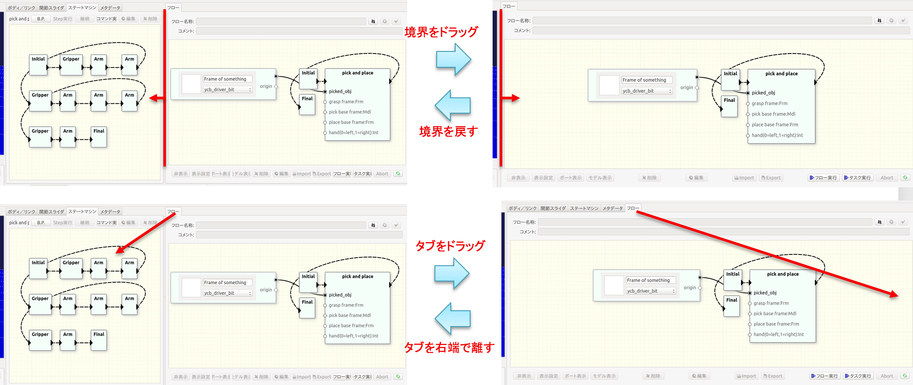

# ビュー操作

##<i class="fa fa-arrow-circle-right" aria-hidden="true"></i> 編集モードと実行モード

動作の実行や検索その他のデータ利用時の操作における、意図しない図の編集やパラメータ値の変更等を避けるため、本ソフトウェアにはモードという概念があります。モードには編集モードと実行モードの2つがあります。

2つのモードの切替えはツールバーの「編集モードへの切り替え」ボタンを用いて行います。ボタンが押された状態が編集モードであり、状態遷移図の編集やシーンビューにおける3Dモデルの移動等の操作が可能となります。ボタンが押されていない状態が実行モードであり、タスクやワークフローの実行を行うためにはこのモードにしておく必要があります。

!!!Note
    編集操作を行うときに、ボタンがグレーになっていて目的の操作を行うことができない場合には、モードを確認してください。

##<i class="fa fa-arrow-circle-right" aria-hidden="true"></i> タスクビュー、ワークフロービューにおける操作

「ステートマシン」ビューおよび「フロー」ビューでは以下の操作が可能です。

* マウスの左ドラッグによる表示位置の移動
* マウスの中ドラッグによる表示の拡大と縮小

##<i class="fa fa-arrow-circle-right" aria-hidden="true"></i> ビュー配置の変更

複数あるビューの配置を自由に変更することができます。必要に応じて不要なビューの上に作業中のビューを配置することで、作業エリアを広くとることができます。

例えば、ワークフローを作成する場合にタスクの状態遷移図は必要がなく、そのスペースを使ってフロービューを大きく利用すると作業効率が上がります。図のように「ステートマシン」ビューと「フロー」ビューの境界をドラッグすることで「フロー」ビューを拡げることができます。全体を「フロー」ビューとして使用する場合は境界を左端までドラッグしても良いですが、「フロー」ビューのタブを「ステートマシン」ビュー内にドラッグして離す操作でもOKです。
ただし、元に戻すときの操作が異なります。境界をドラッグして場合は隠れた境界を再度ドラッグして戻します。タブをドラッグしてビューを重ねた場合は、「ワークフロー」ビューのタブをドラッグして、「ステートマシン」ビューの右端で離します。

これらビュー配置の変更や、「シーン」ビュー内の3Dモデルの操作等はChoreonoidの機能ですので、詳細についてはそちらのマニュアルをご参照ください。
 
