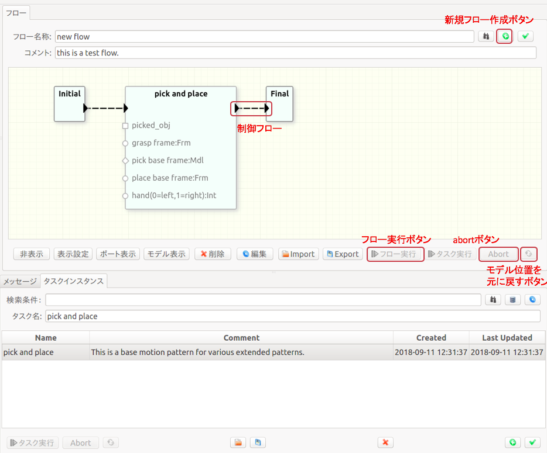
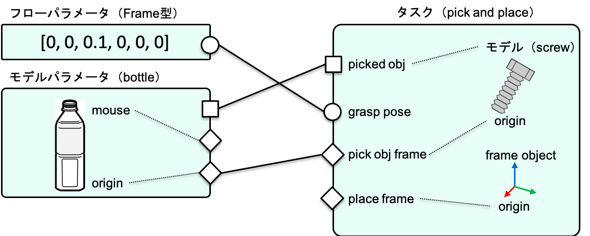
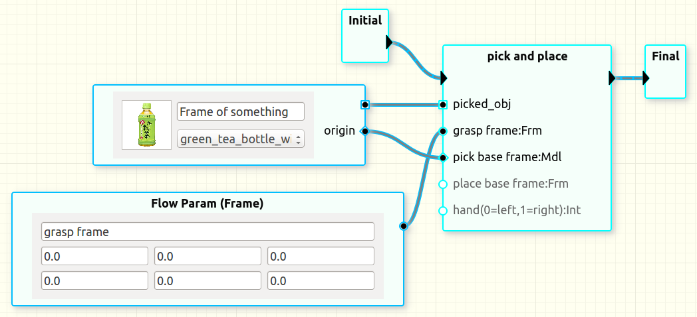
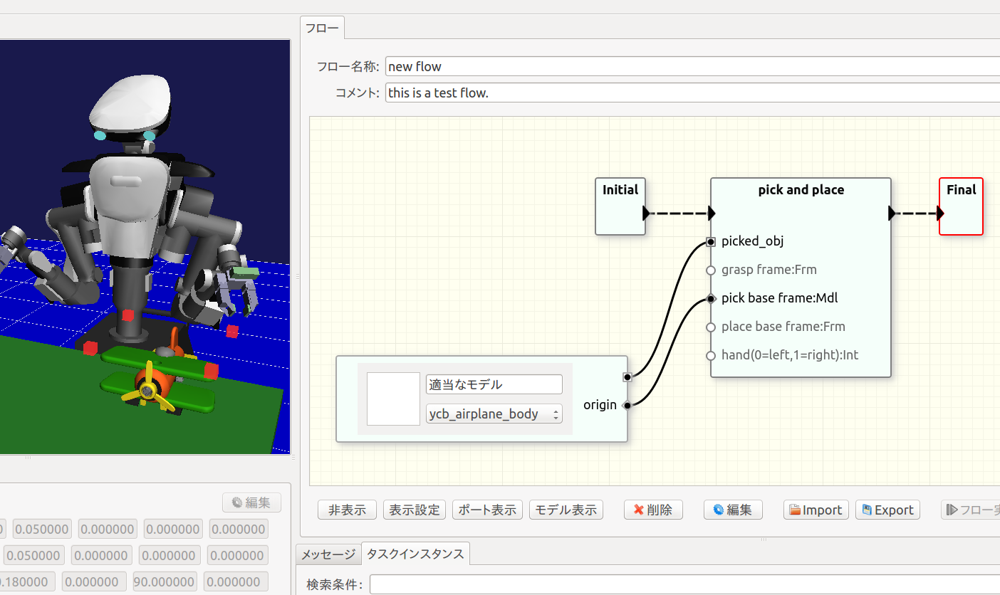
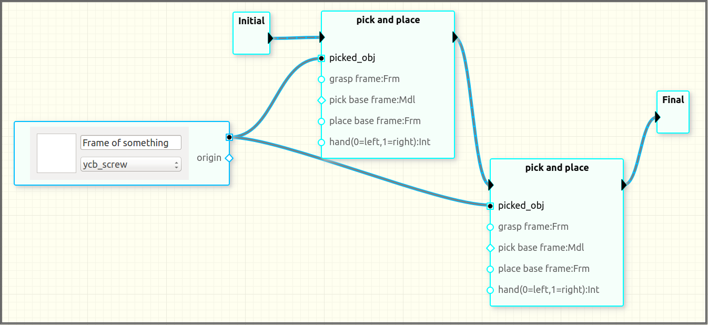
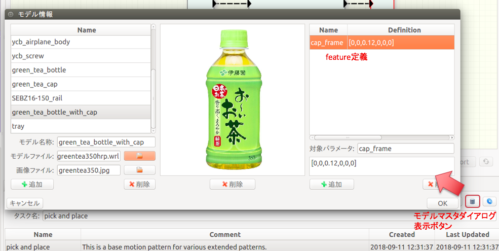
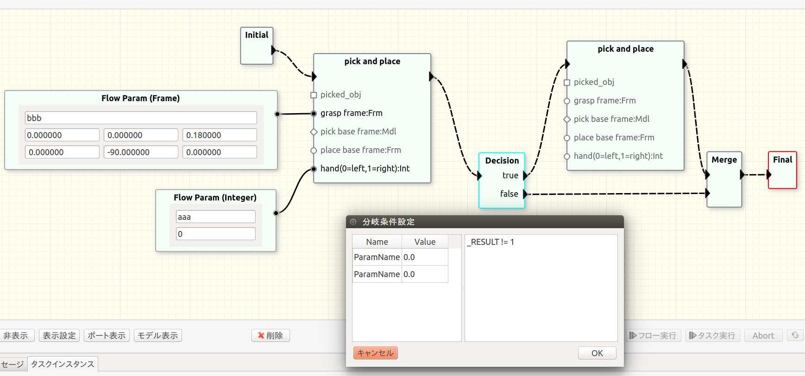

# ワークフロー

本ソフトウェアでは、複数のタスクを組合せることでより長い手順を記述します。これをワークフローと呼びます。本節で説明する操作は「フロー」ビューを用いて行います。

##<i class="fa fa-arrow-circle-right" aria-hidden="true"></i> ワークフローの作成

### 基本的な作図方法

0. [編集モード](/views.md)であることを確認する。
1. 「新規フローを作成する」ボタンを押す。
2. ワークフローに名前をつける。
3. 右クリックメニューからでInitialとFinalノードを追加する。
4. 「タスクインスタンス」ビューの一覧からドラッグ&ドロップしてタスクを追加する。
5. Initialノードから追加したタスクノードへ三角のポート間をドラッグして制御フローをつなぐ。
6. 同様に追加したタスクノードからFinalノードへ制御フローをつなぐ。

<!-- !!!Note -->
<!--     ワークフローに追加したタスクは元データのコピーです。ワークフローでパラメータ値や3Dモデルを差替えても元データは変化しません。これは複数のワークフローで同一タスクを使用した場合の混乱を避けるためです。 -->
<!-- 	現在は、フロー作成時に変更したタスクをタスク一覧に出てくる元データに書戻す機能はありません。 -->
<!--     **今の仕様ではフロー上でタスクを編集することが無くなったのでは？** -->

##<i class="fa fa-arrow-circle-right" aria-hidden="true"></i> ワークフローの実行

ワークフロー全体を実行するには「フロー実行」ボタンを押します。このとき、編集モードはOFFになっている必要があります。

タスク単体を実行するには「タスク実行」ボタンを押します。また、フロー実行中に「フロー」ビューの「abort」ボタンを押すことで、実行を中断することができます。タスクの場合と同様に、「モデル位置を元に戻す」ボタンを押すことで、3Dモデルの配置を初期位置に戻すことができます。

ワークフローの編集時、実行前に状態遷移図の妥当性についてチェックが行われ、エラーが出ることがあります。チェック内容の詳細は[ワークフローのチェック](#workflow_validation) を参照してください。

!!!Note
    タスク単体を実行する場合、副作用（attach/detach）が順番に実行されないため、3Dモデルの移動は必ずしもフロー全体を実行した場合と一致しません。

##<i class="fa fa-arrow-circle-right" aria-hidden="true"></i> ワークフローの調整

単純にタスクを並べて実行した場合、各タスクはそれぞれの動作を初期状態から実行します。前のタスクにより行われた物体位置の変化は次のタスクに引き継がれません。前者で認識処理を行った結果を後者に引き継ぐこともできません。ここではこれらのタスク間の依存関係を記述する方法について説明します。

ワークフローに追加したタスクの調整は主に「フロー」ビュー内のGUI操作で行います。具体的には下記のフローパラメータノードとモデルパラメータノード、そららをつなぐリンクを用いて行います。
<!-- これは、複数のタスク間で値の共有や受け渡しを行いたい場合があり、各タスクのタスクパラメータを個別に変更して連続する動作に一貫性を持たせるよう管理することが難しいからです。 -->

### ポートのセマンティクス

最初にワークフローの調整時に使用するポートやパラメータ、モデルの意味について説明します。

データを操作するためのポート形状には丸、菱形と四角の3種類があります。異なる形状のポートは接続することができません。

丸ポートは単純にタスク実行時のタスクパラメータの初期値を変更するために使用します。図の`grasp pose`は座標系`pick obj frame`からの相対姿勢を表します。この把持姿勢（グリッパの対象物に対する相対位置）を差替える（別の姿勢で把持する）ためにはフローパラメータノード（後述）の丸ポートと接続します。ここで、`grasp pose`の変更は`pick obj frame`に対する座標変換を変更しています。
<!-- outポート指定の場合は単に初期値ではなくなる -->

一方、菱形ポートは座標系の親子関係の変更を意味します。図中の把持対象物の位置姿勢を表すタスクパラメータである`pick obj frame`にモデルパラメータノード（後述）の菱形ポートを接続することで、タスク中で使用される`pick obj frame`が`bottle`オブジェクトの原点を指すように変更します。以後、ユーザがシミュレータ操作で`bottle`を移動させると`pick obj frame`の値も変化します。`pick obj frame`が`bottle`の口の部分を指すように変更したい場合には、`bottle`に定義されたフィーチャ（後述）である`mouse`とリンクを接続します。

ユーザがシミュレータ上で操作する座標系はすべてモデルと対応づけて定義する必要があります（後述のタスク設計の節を参照）。例えば図の`place frame`は対象物を置く場所を表すパラメータです。これをユーザが操作できるようにするためには何らかの3Dモデルに対応づけてタスクを設計しておく必要があります。3Dモデルが対応づけられていないパラメータに座標系をシミュレータ上で操作するためのダミーのモデルであるフレームオブジェクト（RGBの三本矢印）を追加する機能も提供しています。

丸ポートと菱形ポートを使うことでタスクの動作を決めるパラメータを操作することができます。ただし、これだけではロボットが把持する対象物を変更することにはなりません。ロボットによる物体の移動を実現するためにattach及びdetachという仕組みがあります（後述）。attachとdetachの対象はタスク中に記述します。この対象を差替えるために四角ポートを使用します。図中において、`bottle`と`picked obj`をつなぐことでタスク`pick and place`により移動される物品を`bottle`に差替えることになります。四角ポートの接続により隠蔽された3Dモデル（図の場合はscrew）はこのワークフローでは使用されません。

<!-- 四角が繋がっていないとそのタスク実行時にそのモデルが表示されない -->

##<i class="fa fa-arrow-circle-right" aria-hidden="true"></i> フローパラメータ

### 追加

フローパラメータを追加するには、「フロー」ビューにおいて右クリックメニューから`Variables->Flow Param`を選択します。変数には型があります。現在サポートされている型は`Frame`,`Double`,`Integer`です。`Frame`は座標変換を表します。6つの要素は順に`[x,y,z,R,P,Y]`を表します。角度の単位は度です。ここで選択する型は接続するタスクのポートと同じ型である必要があります。右クリックでメニューが表示されない場合は、[編集モード](/views.md)になっていることを確認してください。

### 編集

フローパラメータノードのテキストボックスを利用してノードの名前や値の変更を行うことができます。変数の型はノード生成時に選択します。後で変更したい場合には一度ノードを削除した上で作り直します。

### リンクの作成と値の伝搬

フローパラメータノードは丸ポートを1つ持ちます。このポートはタスクノードの同じデータ型を持つ丸ポートと接続することができます。

!!!Note
    丸ポート同士でもデータ型が異なると接続できません。

新規で作成したフローパラメータノードをタスクノードとつないだときには、そのタスクが持つ値が伝搬します。つまり、タスクのポートとフローパラメータのポートを最初につないだときにタスクが持つ初期値を手作業でコピーする必要はありません。一方で、既にフローパラメータのポートが別のタスクとつながっている（つまり、ユーザによって何らかの意味のある値に設定されている）場合にはリンク作成時に値は伝搬されません。

あるタスクが持つパラメータ値を別のタスクと共有したい場合、コピー元のタスクとフローパラメータを先に接続し、その後でコピー先のタスクとフローパラメータを接続することで手作業での値入力を省略することができます。

一度フローパラメータに値が設定された後に、タスクが持っていた値を取り出したい場合には、そのフローパラメータが持つリンクを全て削除した後に値を取り出したいタスクを最初に接続します。

<!-- 内部的にはフローパラメータの値があとでつないだタスクのパラメータの値に伝搬している -->

!!!Note
    * フローに追加したタスクを選択したときには、パラメータビューにはprivateなパラメータのみ表示されます。
	* パラメータビューを使用してprivateなパラメータの値を変更することができます。

<!-- !!!Note -->
<!--     現在の使用ではタスクパラメータビューでの編集は無効になっています。これが良いかどうかは検討中です。 -->

### ノードとリンクの削除

リンク削除するには、対象のリンクを選択した状態でdeleteキーを押すか、「削除」ボタンを押します。フローパラメータノードを削除するには、対象のノードを選択した状態でdeleteキーを押すか、「削除」ボタンを押します。ノード削除時にそのノードにリンクが繋がっている場合、そのリンクも削除されます。

あるタスクノードのポートからフローパラメータノードにつながるリンクが削除された場合、タスクが使用するパラメータ値はそのタスクがもともと持っていたタスクパラメータの値になります。

### フローパラメータの意味

タスクが持つタスクパラメータを表すポートとフローパラメータノードのポートがつながれているときには、そのタスクはタスクパラメータの代わりにフローパラメータの値を使用します。

タスクがあるタスクパラメータに値を書込むように設計されている場合、そのタスクパラメータとフローパラメータをつなぐことで、値をフローパラメータに取出すことができます。これを次に実行されるタスクで使用することでタスク間で値の受渡しを実現します。

<!-- フローパラメータへの値の出力と同期のタイミングについて -->
タスクがタスクパラメータに書込んだタイミング（タスク実行中）につながれたフローパラメータの値も更新されます。

<!-- !!!Important -->
<!--     モデルパラメータへの値の出力はサポートされたんだっけ？ -->

<!-- モデルパラメータへの値の出力については、origin以外のfeatureへの値の出力は対応していません** -->

##<i class="fa fa-arrow-circle-right" aria-hidden="true"></i> モデルパラメータ

### 追加

モデルパラメータを追加するには、「フロー」ビューにおいて右クリックメニューから`3D Models->Model Param`を選択します。

### 編集

モデルパラメータノードのテキストボックスを利用してノード名を変更することができます。モデルパラメータノードはワークフローの実行環境における物品と対応します。つまり、1つのノードが1つの物品を表し、異なるノードは異なる物品を表します。  
物品の種類は[3Dモデルマスタ](#model_master)として表現され、モデルパラメータノードは3Dモデルマスタへの参照を保持します。モデルマスタノードのドロップダウンリストをクリックすると3Dモデルマスタの一覧が表示され、そこから選択することでそのノードが指すマスタを切替えることができます。

### リンクの作成

モデルパラメータノードは1つの四角ポートと、1つ以上の菱形ポートを持ちます。四角ポートを接続することで、タスクで操作対象となる3Dモデルを入替えることができます。  
図中ではもともとペットボトルをpick&placeするタスクのpick対象を表す四角ポートにモデルパラメータノードの四角ポートを接続し、マスタを飛行機に変更しています。タスクに接続した状態でマスタを変更すると「シーン」ビュー中の3Dモデルも変更されます。

!!!Note
    * 3Dモデルノードを作成しただけではシーン中に表示されません。タスクにつないで初めて表示されます。
    * 3Dモデルが表示される位置はタスクが保持していた位置・姿勢を引継ぎます

!!!Important
    四角ポートはタスクが行う操作（現在はattachとdetachのみ）対象を変更するもので、これだけでロボットの動作が変化することはありません。

3Dモデル上に定義された座標系をタスクで利用するためには菱形ポートを使用します。例えば上図においてタスク`pick and place`は`pick base frame`に把持対象物の位置を指定するよう設計されています。ここにモデルパラメータノードが表す物品の原点位置を入力するにはモデルパラメータノードの丸ポート`origin`とタスク`pick and place`の丸ポート`pick base frame`をつなぎます。

3Dモデルにorigin以外の[feature](#model_master)が定義されている場合、それらをタスクの丸ポートとつなぐこともできます。例えばペットボトルのキャップを閉めるタスクでは、ペットボトルの種類による違いをキャップ位置としてパラメータ化することが考えられます。このときに、そのキャップ位置をモデル側にfeatureとして定義し、タスクにキャップ組付け位置として入力する使い方ができます。

!!!Note
     リンクが張られたノードのマスタを変更した場合、張られていたリンクは削除されます。

<!-- * ポート数もポート名も変化するので既存のリンクは削除される -->
<!-- * そもそも変更後のどのポートとつなぐことを規定しているか一般にはわから -->
<!--   ない -->

<!-- !!!Note -->
<!--      現在の仕様では、3Dモデル上のフレームを想定したポートにフローパラメータのポートを接続したり、その逆を行うことはできません。それを明示するために丸ポートと菱形ポートで区別しています。 -->

### 3Dモデルの共有

図のようにリンクを接続することで、複数のタスクで同一の3Dモデルを操作することができます。つまり、1つ目の`pick and place`でネジを移動した後、その移動したネジを2つ目の`pick and place`で移動させます。

<!-- * **2つ目のタスクのモデルがscrewにならない（ペットボトルのまま）=> つないだときにモデルが変わるように修正されればこれも直るはず** -->

### ノードとリンクの削除

リンク削除するには、対象のリンクを選択した状態でdeleteキーを押すか、「削除」ボタンを押します。モデルパラメータノードを削除するには、対象のノードを選択した状態でdeleteキーを押すか、「削除」ボタンを押します。ノード削除時にそのノードにリンクが繋がっている場合、そのリンクも削除されます。

!!!Note
    あるタスクノードのポートからモデルパラメータノードにつながるリンクが削除された場合、タスクが参照する3Dモデルおよびパラメータ値はそのタスクがもともと持っていたものに戻ります。

<!-- ノードとChoreonoidのアイテム名との対応 -->

##<i class="fa fa-arrow-circle-right" aria-hidden="true"></i> <a id="model_master">3Dモデルマスタ</a>

タスクやワークフローで利用する3Dモデルは3Dモデルマスタとして別に管理されます。これは、ワークフローでタスクを利用するときに差替えたり共有するモデル群を管理するためです。

* マスタは必須項目として名称と3D形状を持ちます。
* 3D形状は[OpenHRPで用いられている記述形式](https://fkanehiro.github.io/openhrp3-doc/jp/create_model.html)のVRMLファイル（*.wrl）で指定します。
* オプションとしてアイコン画像およびfeature（3Dモデル上に定義する座標系）を持つことができます。

### 新規マスタ登録

新規マスタを登録するには2種類の方法があります。1つはダイアログで登録する方法です。図中のボタンを押すとモデルマスタ情報を編集するためのダイアログが表示されます。このダイアログを用いてアイコン画像の追加、変更、削除や、featureの追加、変更、削除等の操作を行うことができます。

!!!Note
    タスクやフローで使用しているマスタやfeatureのデータは削除できません。

もう1つのマスタ登録方法は[YAMLファイル](/task_design/#yaml_format)import時の自動追加です。このimport時の登録については[import/export](/import_export.md)で説明します。

##<i class="fa fa-arrow-circle-right" aria-hidden="true"></i> ワークフローの保存と読出し

「現在のワークフローを保存」ボタンを押すと表示しているワークフローを保存します。このとき、3Dモデル位置が変わっている場合は、間違って保存しようとしている可能性が高いため、確認するメッセージボックスが表示されます。

以前に作成したワークフローを読出すには、「フローを検索」ボタンを押し、読出したいフローを選択、「開く」ボタンを押します。ワークフローを開くと、既に開いていたフローに対して行なっていた編集内容で保存されていないものは破棄されます。

<!-- 保存されていない旨の警告を出すことは可能？ -->

##<i class="fa fa-arrow-circle-right" aria-hidden="true"></i> ワークフローの編集

### タスク名の変更

タスクノードをダブルクリックすることでタスクノード名を変更することができます。同じパターンを複数使用する場合など、名前を変更して見分けがつくようにします。

### 条件分岐と合流

ワークフローは逐次実行の他に条件分岐と合流を記述できます。図のように条件分岐（Decision）ノード により制御フローを分岐させ、合流（Merge）ノードによる分岐した制御フローを合流させます。

!!!Note
    1つの三角ポートに複数の制御フローを直接つないで合流させる記法は許されていません。

Decisionノードをダブルクリックすると分岐条件を記述するダイアログが開きます。右側に分岐条件式を入力します。分岐条件式の構文は[タスク設計で使用するもの](/task_design/#tp_exp_syntax)と同じです。ただし、使用できる変数はフロー変数と直前のタスクの実行結果のみです。利用できるフロー変数の一覧がダイアログの左側に表示されます。直前のタスクの実行結果は特殊な変数`_RESULT`により取得します。直前のタスクの実行結果とはそのタスクの最後に実行したコマンドの成否です。

!!!Note
    データ型の実装が途中であるため論理値は存在しません。0をfalse、0以外の数値をtrueと判断します。例えば直前のタスクの実行結果がfalseの場合にDecisionノードのtrueに分岐させたい場合には`_RESULT == 0`と書きます。

##<i class="fa fa-arrow-circle-right" aria-hidden="true"></i> その他

### <a id="workflow_validation">ワークフローの妥当性</a>

不正な状態遷移図によるトラブルを削減するため、ワークフローの編集時および実行前にいくつかのチェックが行われます。具体的には以下の項目をチェックし、問題があればエラーメッセージが表示されますので、メッセージに応じて修正をしてください。

#### 編集時チェック

* 同一ノードのタスク間の制御フローの接続は許されない
* 接続するポートは種別（制御フローやデータフロー）とデータ型の同一性
<!-- * 1つのモデルポートないしフローポートへの複数のデータフローの接続 -->

#### 実行前チェック

* スタートノードが1つだけあること
* スタートノードから複数の制御フローが出ていないこと
* スタートノードに入っている制御フローが存在しないこと
* Finalノードから出ているフローが存在しないこと
* Finalノード以外から制御フローが出ていること
* Decisionノードからtrue、falseの場合の 制御フローが1つずつ出ていること
* Decision以外のノードで1つのノードから複数のフローが出ていないこと
* パラメータ名の重複が存在しないこと

### フロー図要素の可視属性

フロービューの複雑性を抑える1つの方法として図中の要素の可視属性を設定する機能があります。設定が終わったパラメータを非表示にすることで編集したい情報に集中することができます。

#### ノードの表示/非表示

フロービューでフローパラメータやモデルパラメータ、タスクのノードを選択した状態で「非表示」ボタンを押すことでそれらのノードが非表示に設定されます。各ノードが表示されているかどうかは、実行結果に影響しません。

また、「表示設定」ボタンを押すとフロービュー中のノード一覧が表示されます。既に表示されているノードのチェックボックスにはチェックが入っています。 ここでチェックを入れることで表示、チェックを外すことで非表示に設定することができます。

#### ポートの表示/非表示

タスクノードが持つ菱形ポートや丸ポートはタスクが持つパラメータを表します。これらのパラメータはタスクについてローカルかグローバルかの属性を持ちます。タスクにローカルなパラメータはタスクノードにポートとしては表示されません。

フローパラメータとモデルパラメータは主に、複数のタスク間で共有される値や3Dモデルの整合性を取り易くするために使用します。そのためタスク間で共有するものはグローバルに設定することでポートとして表示され、他のノードとつなぐことができます。一方で、単一のタスクの調整にのみ使用するものはローカルなパラメータとしておくことでタスクノードの表示を簡潔にすることができます。この場合、ローカルなパラメータの値の変更はパラメータビューで行います。

### ワークフローの統合環境

<!-- 統合された3Dモデル -->

シミュレータ画面では通常、選択されたタスクが仕様している3Dモデルのみが表示されます。そうではなく、フローで使用している全てのモデルを表示し、それらの位置関係を確認したい場合があります。「全表示」チェックボックスにチェックを入れることでワークフローで使用されている全モデルを表示することができます。また、この状態で全ての3Dモデルの位置関係を見ながらレイアウト調整を行うことができます。全表示状態でフローを実行することもできます。「全表示」チェックボックスのチェックをはずすことでタスク単位での3Dモデル表示に戻ります。
